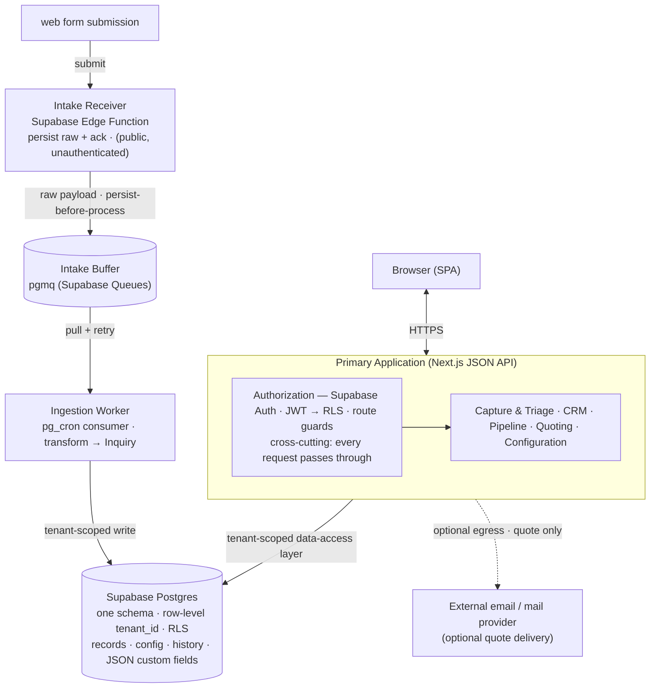
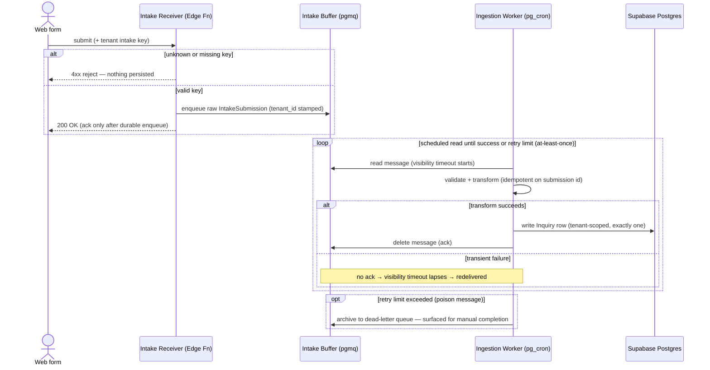
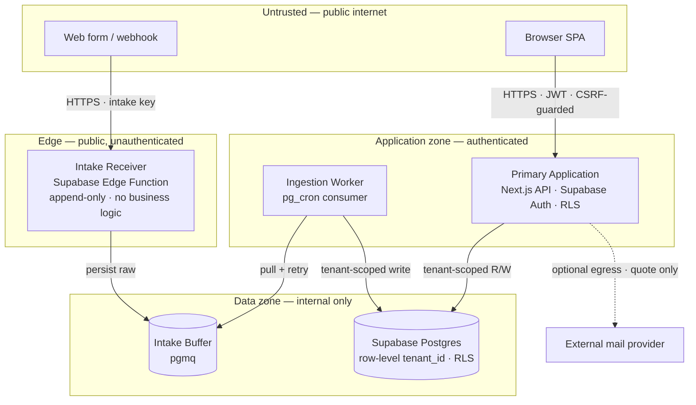

# ARCHITECTURE.md — System Architecture

**Owner:** Architect
**Last updated:** 2026-07-14
**Source of truth for:** the system structure, component boundaries, and design decisions that satisfy the CuevikSync Phase 1 thin-core PRD.

> Derived from: docs/PRD.md
> Downstream: docs/TECH-STACK.md, docs/AI-TOOL-GUIDE.md, README.md, docs/BACKLOG.md

## Document References

Document availability and maturity are tracked in README.md (Documentation Status).

| # | Document | Role | Status |
| --- | --- | --- | --- |
| 1 | PRODUCT.md | What we are building and why | Present |
| 2 | PRD.md | Testable requirements | Present |
| 3 | ARCHITECTURE.md | System structure & design decisions | Present |
| 4 | TECH-STACK.md | Approved technologies & usage rules | Planned |
| 5 | AI-TOOL-GUIDE.md | Rules & constraints for AI tools | Planned |
| 6 | README.md | Setup, env config, how to run | Present |
| 7 | BACKLOG.md | Epics/stories manifest | Planned |

---

## Contents

1. [System Architecture](#1-system-architecture)
2. [Data Design](#2-data-design)
3. [Data Flow & Interactions](#3-data-flow--interactions)
4. [Key Design Decisions](#4-key-design-decisions)
5. [Implementation Conventions](#5-implementation-conventions)
6. [Integration Points](#6-integration-points)
7. [Security Posture & Data Classification](#7-security-posture--data-classification)
8. [Non-Functional Approach](#8-non-functional-approach)
9. [Observability & Operations](#9-observability--operations)

---

## 1. System Architecture

CuevikSync thin-core is a multi-tenant Software-as-a-Service (SaaS) application built as
a **Next.js modular monolith on Supabase**, with two supporting runtime roles carved out
for the zero-leak capture path. Three runtime roles share one **Supabase Postgres**
datastore:

1. **Intake Receiver** — a small, public, unauthenticated **Supabase Edge Function** that
   accepts web-form submissions, persists each raw payload to the durable intake buffer, and
   acknowledges immediately. Deploying it as an Edge Function keeps it isolated from the
   Next.js application's runtime. It runs no business logic. (PRD-001, NFR-002, NFR-003)
2. **Ingestion Worker** — a scheduled consumer (**pg_cron** or a scheduled Edge Function)
   that reads buffered submissions from the queue and transforms each into an Inquiry record,
   retrying on failure so nothing is dropped. (PRD-001, NFR-001)
3. **Primary Application** — the Next.js modular monolith, exposing a Single-Page Application
   (SPA) over a server JSON Application Programming Interface (API). It holds the domain modules
   and the cross-cutting authorization layer. Authentication is delegated to
   **Supabase Auth (GoTrue)**; tenant scoping and row ownership are enforced in **Postgres by
   Row-Level Security (RLS)** on every authenticated user request, with the caller's Supabase
   JSON Web Token (JWT) carried in an httpOnly cookie and forwarded by the application to the
   database. (PRD-023, PRD-025, NFR-008)

Splitting the Intake Receiver and Ingestion Worker from the Primary Application keeps
inbound capture available even when the authenticated application is degraded, which the
capture NFRs demand (NFR-002, NFR-003).

Components:

- **Intake Receiver** — a public, unauthenticated **Supabase Edge Function** that accepts and
  durably persists raw web-form submissions; no transformation, no authentication,
  deployment-isolated from the app. (PRD-001, NFR-002, NFR-003)
- **Intake Buffer** — a durable **pgmq (Supabase Queues)** queue holding raw submissions until
  the worker processes them; the persist-before-process point that makes a dropped submission
  physically hard. (NFR-002)
- **Ingestion Worker** — a **pg_cron**-scheduled (or scheduled Edge Function) consumer that
  converts buffered submissions into tenant-scoped Inquiry records with retry on failure.
  (PRD-001, NFR-001)
- **Authorization layer** — cross-cutting; resolves identity via Supabase Auth, and on every
  authenticated request the caller's JWT drives **Postgres RLS**, which applies tenant scope
  and the static role policy at the database, fronted by app-side route guards.
  (PRD-023, PRD-025, PRD-027, NFR-008)
- **Capture & Triage module** — the shared inquiry queue, manual logging, priority, and
  provenance. (PRD-002 – PRD-007, PRD-028)
- **CRM module** — contact and company records, multi-company associations, and
  duplicate-on-create detection. (PRD-008 – PRD-010)
- **Pipeline module** — configurable pipelines and stages, opportunities with mandatory
  fields, stage movement with history, and terminal outcomes. (PRD-011 – PRD-015)
- **Quoting module** — quotes, line items, totals, the status lifecycle, issuance, and the
  flat catalog. (PRD-016 – PRD-021)
- **Configuration module** — admin-only custom fields, pipeline configuration, and catalog
  maintenance, all effective without a deploy. (PRD-011, PRD-021, PRD-022, PRD-026)
- **SPA Client** — the browser application; renders records and dynamic custom-field forms
  and consumes the JSON API. It never holds authority over access decisions. (PRD-025)
- **Supabase Postgres** — one schema holding every tenant's records, configuration,
  per-entity history, and JSON custom-field values, isolated by `tenant_id` and enforced by
  RLS. (NFR-006, NFR-008)

## 2. Data Design

The domain is a connected graph of relational entities, so the primary store is relational.
Every tenant-owned entity carries a `tenant_id` and is reached only through the tenant-scoped
data-access layer (see §4, §5). Custom-field values are held in a per-record JSON column
described by a per-tenant field-definition catalog.

Core entities:

| Entity | Purpose | Key relationships |
| --- | --- | --- |
| Tenant | The account/isolation boundary | Owns every other record |
| User | An authenticated person with one static role | Belongs to a Tenant; owns Opportunities/Quotes |
| Inquiry | A captured lead with channel, priority, and provenance | Optional link to Contact/Company; qualifies into Opportunity |
| IntakeSubmission | The durable raw web-form payload before transformation | Produces an Inquiry (traceable) |
| Contact | A person record | Many-to-many with Company |
| Company | An organization record | Many-to-many with Contact |
| ContactCompany | The association enabling multi-company contacts | Joins Contact and Company (PRD-009) |
| Pipeline | A tenant-configurable process | Has ordered Stages |
| Stage | A named, ordered step, one or more terminal | Belongs to a Pipeline |
| Opportunity | A deal with a stage, owner, and next action | Links Inquiry, Contact, Company, Pipeline |
| StageHistory | Append-only record of stage moves | Belongs to an Opportunity (PRD-013) |
| Quote | A commercial offer with a status and total | Belongs to an Opportunity; has QuoteLines |
| QuoteLine | A catalog or free-form line with quantity and unit price | Belongs to a Quote |
| QuoteStatusHistory | Append-only record of status changes | Belongs to a Quote (PRD-019, NFR-011) |
| CatalogItem | A flat sellable item (name + unit price + active flag) | Referenced by QuoteLine (PRD-017, PRD-021) |
| FieldDefinition | A per-tenant custom-field descriptor (record type, name, type) | Describes JSON values on target records (PRD-022) |

Storage rules:

- Core, typed attributes live in native columns; tenant-defined custom values live in one
  JSON column per record on Inquiry, Contact, Company, and Opportunity, validated in the
  application layer against the FieldDefinition catalog. (PRD-022)
- StageHistory and QuoteStatusHistory are append-only and written in the same transaction as
  the state change they record. (PRD-013, PRD-019, NFR-011)
- The IntakeSubmission (raw buffer) retains the original message content so provenance
  survives even if transformation is delayed. (PRD-004, NFR-002)

## 3. Data Flow & Interactions

**Zero-leak capture (web form).** The defining flow. The raw payload is durable before any
processing occurs.

**Intake tenant resolution.** The public Edge Function is unauthenticated but not
untargeted: each tenant is issued a unique, unguessable intake key (embedded in its
hosted form or webhook URL). The Intake Receiver resolves that key to a `tenant_id`,
stamps it on the raw `IntakeSubmission` before enqueueing to pgmq, and rejects an unknown or
missing key before anything is persisted. Delivery from the pgmq queue to the worker is
at-least-once (a message unacked before its visibility timeout lapses is redelivered), so the
transform is idempotent on the submission identifier — one `IntakeSubmission` yields exactly
one Inquiry even when the worker retries. A deterministic failure (a malformed payload) is
archived to a dead-letter queue after at most 3 reads and alerted; a transient failure (for
example a datastore outage) is redelivered with backoff until it succeeds. A submission is
never silently dropped and never retried without limit. (PRD-001, PRD-030, NFR-002)

Other flows all pass through the authenticated API and its authorization pipeline:

- **Manual logging** — a user posts an email/phone/walk-in inquiry with channel and
  priority; it lands in the same shared queue as web captures. (PRD-002, PRD-003)
- **Triage → qualify** — a user converts an inquiry into an Opportunity attached to a
  Contact and Company; the Opportunity links back to the originating Inquiry. (PRD-007)
- **Pipeline movement** — a stage move writes a StageHistory row (actor + timestamp) in the
  same transaction; terminal outcomes drop the Opportunity from the active view.
  (PRD-013, PRD-014)
- **Quoting** — line items (catalog or free-form) build a Quote; the total recomputes on any
  line change; status transitions are validated by a state machine; issuance marks the Quote
  sent (explicit user action) and MAY egress to an external email provider. (PRD-016 – PRD-020)
- **Configuration** — an admin edits pipelines, stages, custom fields, or the catalog; changes
  are read from tenant configuration data at runtime and take effect with no deploy.
  (PRD-011, PRD-021, PRD-022)

Every read and write is filtered by tenant scope and then authorized by the static role
policy before a domain module runs. (PRD-025, NFR-008)

## 4. Key Design Decisions

Each row states the choice, the requirement it traces to, the alternative rejected, and the
trade-off it accepts. Technology selection is deferred to TECH-STACK.md.

| Decision | Choice | Rationale |
| --- | --- | --- |
| Capture path | Durable intake queue + async worker — pgmq (Supabase Queues) + pg_cron/Edge consumer (persist-before-process) | Traces NFR-001/002/003, PRD-001. Persisting the raw payload before any processing makes a dropped submission physically hard, and isolating intake keeps capture up when the app is degraded. Rejected: pure synchronous write (a transform or datastore error silently drops the lead — violates NFR-002). Trade-off: one extra runtime role and eventual consistency (records land in seconds, inside the 2-minute p99 budget). Delivery is at-least-once via pgmq visibility-timeout redelivery; the transform is idempotent and poison messages are archived to a dead-letter queue (see §3), so retries neither drop nor duplicate a lead. |
| Application topology | Modular monolith + intake receiver + worker (3 roles, 1 datastore) | Traces NFR-004/005/006. In-process module calls give low latency at 10 concurrent users and stay trivial to operate inside the 3-day onboarding budget. Rejected: distributed services per domain (network hops and distributed data add latency and ops load with no scale payoff at this size). Trade-off: module boundaries are a discipline, not network-enforced; scaling is coarse-grained. |
| Tenant isolation | Shared schema, row-level `tenant_id`, enforced by Postgres RLS on authenticated user paths | Traces NFR-004/006, NFR-008. Instant shared-schema provisioning suits lean SMB onboarding; RLS makes tenant scope a database guarantee, so a forgotten filter on an authenticated user path cannot leak across tenants. Rejected: schema-per-tenant and database-per-tenant (heavier provisioning that fights NFR-004, with no requirement demanding physical isolation) and app-layer-only scope (a single unscoped query leaks). Trade-off: RLS keys on the request's Supabase JWT, so the three identity-less system paths — Intake Receiver, Ingestion Worker, tenant provisioning — run under the Supabase service-role (RLS bypassed) and MUST re-enforce tenant scope in code from a server-resolved `tenant_id`, never from caller input. |
| Custom-field storage | Field-definition catalog + one JSON value column per record | Traces PRD-022, NFR-005. A per-tenant catalog drives dynamic forms and validation; values in a JSON column add fields with no deploy and no shared-schema pollution. Rejected: Entity-Attribute-Value tables (many joins and weak typing risk NFR-005 at 50k records) and per-tenant physical columns (incompatible with the shared schema). Trade-off: filtering/sorting on a custom field relies on JSON indexing, and type validation lives in the application layer. |
| Client/server boundary | SPA + server JSON API; API is the sole access authority | Traces PRD-025, NFR-008, NFR-005. A rich client serves the quote builder, pipeline board, and dynamic custom-field forms; the API is the single server-side enforcement point. Rejected: server-rendered multi-page app (live totals and board interactions need extra work) — the SPA better fits the interaction model. Trade-off: heavier client and first-load bundle, and WCAG 2.1 AA (NFR-012) becomes a client responsibility. |
| Authorization structure | Database-enforced RLS on every authenticated request (tenant scope + row ownership), fronted by Supabase-Auth authentication and app-side route guards; service-role confined to system paths | Traces PRD-023/025/026/027, NFR-008. The caller's JWT rides in an httpOnly cookie, which the app forwards to Postgres so RLS decides tenant scope and record ownership — the enforcement locus is the database, non-bypassable for user traffic; admin-only route guards sit in the app in front of RLS. Rejected: per-module ad-hoc app-layer checks (rules scatter and one omission is a leak). Trade-off: RLS policies plus JWT claims are now load-bearing and must be correct and fast; the service-role system paths are the only escape and are deliberately few, isolated (§7), and audited. |
| Role model | Static four-role policy (PRD-024) expressed as JWT claims + RLS policies and app-side route guards | Traces PRD-024, PRD-027. Exactly four roles with fixed boundaries match the PRD with no gold-plating; the role travels as a JWT claim and is enforced by RLS at the row level and by admin-only route guards for configuration. Rejected: configurable per-tenant roles (capability beyond the PRD that enlarges the NFR-008 test surface). Trade-off: adding or changing a role later means editing code and RLS policies plus a deploy, not per-tenant configuration. |
| Audit model | Per-entity history tables written in the same transaction | Traces PRD-013, PRD-019, NFR-011. Dedicated `StageHistory` and `QuoteStatusHistory` tables target exactly the two required audit points and directly serve "viewable on the opportunity". Rejected: a single generic audit log (reconstructing one entity's history means filtering a mixed log). Trade-off: auditing a new entity later means adding a table. |
| Authentication | Managed first-party auth — Supabase Auth (GoTrue), JWT-based | Traces PRD-023, NFR-007. Supabase Auth stores our own users' credentials in our Supabase Postgres (first-party, not a third-party IdP) and issues a JWT that authenticates every request and drives RLS. GoTrue hashes passwords with bcrypt at a work factor ≥ 12, which satisfies NFR-007's slow-salted-hash requirement. Rejected: a hand-rolled credential store (re-implements what the managed service provides) and external Identity Provider (IdP) / third-party Single Sign-On (no requirement asks for it this release). Trade-off: auth behavior is bounded by what Supabase Auth supports, and no enterprise SSO until a later release adds it. |
| Quote & pipeline transitions | Domain state machine rejecting invalid transitions | Traces PRD-014, PRD-019. Enforcing `draft → sent → accepted/declined` and terminal Won/Lost in one place prevents illegal states. Rejected: ad-hoc status flags updated inline (invalid transitions slip through). Trade-off: transitions must be declared centrally, not set field-by-field. |
| Customer-facing output | Explicit human "mark sent", decoupled from delivery | Traces PRD-020, PRD §11. Marking a quote sent is always a user action; delivery (in-app email or external channel) is separate, so nothing auto-sends. Rejected: automatic send on quote completion (violates the human-in-the-loop constraint). Trade-off: send state and delivery state are tracked separately. |
| Concurrency control | Optimistic concurrency (per-record version) on Opportunity and Quote | Traces PRD-013, NFR-011. A version check rejects a stale write, so a concurrent edit cannot silently overwrite a stage move or the history row that records it. Rejected: last-write-wins (a lost update corrupts the audit trail the design relies on). Trade-off: a rejected write must be re-fetched and reapplied by the client. |

## 5. Implementation Conventions

Structural rules every contributor follows. These are how to build, not the code itself.

- **Tenant scope is enforced by the database.** All authenticated user requests carry the
  caller's Supabase JWT — held in an httpOnly cookie — to Postgres, where RLS filters every row
  by `tenant_id`; no user-path
  query may bypass it. The Intake Receiver, Ingestion Worker, and provisioning run under the
  service-role and MUST re-apply `tenant_id` in code from a server-resolved value.
  (PRD-025, NFR-008)
- **Authorize before domain logic.** Every API request authenticates via Supabase Auth and
  passes the role route guard (admin-only configuration is Owner/Admin only) before a domain
  module executes; RLS then enforces tenant scope and record ownership at the database.
  (PRD-023, PRD-026, PRD-027, NFR-008)
- **Configuration is data, not code.** Pipelines, stages, custom fields, and the catalog are
  read from tenant configuration at runtime; changing them MUST NOT require a deploy.
  (PRD-011, PRD-021, PRD-022, NFR-004)
- **Persist raw before processing.** The Intake Receiver (Supabase Edge Function) MUST durably
  enqueue a submission to pgmq before any transformation and MUST NOT run business logic
  inline. (PRD-001, NFR-002)
- **State changes go through the state machine.** Quote status and opportunity terminal
  outcomes are changed only via declared transitions; invalid transitions MUST be rejected.
  (PRD-014, PRD-019)
- **Audit in the same transaction.** A stage move or quote-status change and its history row
  commit together, recording actor and timestamp. (PRD-013, PRD-019, NFR-011)
- **Validate custom fields against the catalog.** Custom-field values MUST be validated
  against their FieldDefinition (type and target record) before persistence. (PRD-022)
- **Enforce mandatory opportunity fields server-side.** Saving an opportunity without a
  stage, owner, and next action MUST be blocked with a validation message. (PRD-012)
- **Warn, don't block, on duplicates.** Contact/company creation runs duplicate detection at
  create time and warns; the user may proceed or cancel. (PRD-010)
- **Server-side is the source of truth for access.** The SPA MUST NOT be the authority for
  visibility or edit rights; a bypassed client MUST still be denied. (PRD-025, NFR-008)

## 6. Integration Points

| Integration | Direction | Contract / notes |
| --- | --- | --- |
| Web-form intake | Inbound | Hosted form or webhook posts submissions to the public, unauthenticated Intake Receiver over HTTPS; raw payload persisted on receipt. If not embedded, all channels fall back to manual logging. (PRD-001, dep §10) |
| Outbound email / quote delivery | Outbound (optional) | The API MAY hand a quote document to an external email or transactional-mail provider; delivery is optional and "mark sent" is independent of it, so quotes can also be shared through an external channel. (PRD-020, dep §10) |
| Authentication | Internal | Supabase Auth (GoTrue) — managed first-party credential store (users in our Supabase Postgres, bcrypt work factor ≥ 12), JWT-based; no external IdP this release. Auth precedes RBAC, and the JWT drives RLS on every request. (PRD-023, NFR-007) |
| Managed hosting & backup | Platform | Availability (NFR-003), durability (NFR-010), and recovery time (NFR-013) assume Supabase managed infrastructure; concrete backup and restore tooling are detailed in TECH-STACK.md. (dep §10) |

## 7. Security Posture & Data Classification

**Data classification.** Sensitivity levels: public / internal / confidential / restricted.

| Data category | Classification | Handling |
| --- | --- | --- |
| User credentials | Restricted | Managed by Supabase Auth (GoTrue) as slow, salted bcrypt hashes at work factor ≥ 12; never logged or returned. (NFR-007) |
| Contact / company personal data | Confidential | Personal data under GDPR; tenant-scoped, RBAC-gated, deletable with a linked-record warning. (PRD-008, PRD-025) |
| Inquiry content & provenance | Confidential | May contain customer personal data; tenant-scoped and role-gated. (PRD-004) |
| Opportunity & quote commercial data | Confidential | Business-sensitive; visible per role and ownership rules. (PRD-027) |
| Pipeline / stage / catalog / custom-field config | Internal | Admin-only write; readable within the tenant. (PRD-026) |
| Tenant & role assignments | Internal | Admin-only; scopes all other access. (PRD-024) |

Payment instruments and financial data are **never stored** — permanently out of scope,
which keeps the system out of payment-card compliance scope by design. (PRD §11)

**Authentication & authorization.** Supabase Auth (GoTrue) authenticates every request and
issues a JWT (PRD-023). The application forwards that JWT — carried in an httpOnly cookie — to
Postgres, where **RLS** decides tenant scope and record ownership at the database, in front of which an app-side admin-only
route guard gates configuration — enforced server-side on every authenticated read and write,
so a bypassed client is still denied. The three identity-less system paths (Intake Receiver,
Ingestion Worker, provisioning) run under the Supabase **service-role** and re-enforce tenant
scope in code from a server-resolved `tenant_id`. (PRD-025, PRD-027, NFR-008)

**Encryption.** All traffic is served over Transport Layer Security (TLS) 1.2 or higher;
plaintext HTTP is rejected (NFR-009). Credentials are hashed rather than encrypted (NFR-007).
Encryption at rest is a requirement on Supabase Postgres; the specific mechanism is a
TECH-STACK.md decision.

**Trust boundaries & network exposure.**

- The **Intake Receiver (Supabase Edge Function)** is the only public, unauthenticated surface;
  deploying it as an Edge Function isolates it from the Next.js application so an anonymous
  flood cannot take the app down, and it only ever appends to the durable pgmq buffer.
  (NFR-002, NFR-003)
- The **JSON API** requires an authenticated Supabase JWT for every record operation. (PRD-023)
- The **datastore, pgmq buffer, and pg_cron worker** are internal, reachable only by the
  application roles.
- **Outbound email** is the only egress to a third party and carries only what a quote
  contains.

Each boundary is a trust step down: the untrusted public reaches only two surfaces
(the intake key on the Receiver, an authenticated session on the API); the buffer,
worker, and datastore are never publicly reachable; and the sole third-party egress
carries quote content only.

**Data lifecycle & retention.** Raw `IntakeSubmission` payloads are purged 30 days after
their Inquiry is created; a submission stuck in the dead-letter state is retained until
resolved, to a 90-day hard cap, then escalated and exported before purge — never silently
deleted (PRD-029). Erasing a contact or company (PRD-008) removes or pseudonymizes personal
data in the record and in any raw payload that references it, while the append-only
`StageHistory` and `QuoteStatusHistory` keep their immutable event skeleton (actor,
timestamp, transition) with personal data stripped — so audit integrity and the right to
erasure hold together. Durability boundary: NFR-010 permits up to 24 h of committed data
loss on a disaster restore, which applies to acknowledged captures too; the durable buffer
narrows this window but does not eliminate it.

**Compliance.** GDPR applies (contact data is personal data). The architecture answers with
tenant isolation, server-side RBAC, explicit data classification, contact/company deletion
supporting erasure requests, TLS in transit, and hashed credentials. No HIPAA, SOC 2, or
payment-card obligations are stated in PRD.md, and none are introduced here.

**Threat vectors the design accounts for.**

- Cross-tenant access → Postgres RLS enforces tenant scope on every authenticated user path;
  service-role system paths re-scope in code. (PRD-025, NFR-008)
- RBAC bypass via a tampered client → RLS and route guards enforce server-side on every
  request; the SPA holds no authority. (NFR-008)
- Credential theft → Supabase Auth bcrypt (≥ 12) hashing and TLS. (NFR-007, NFR-009)
- Anonymous intake abuse on the public endpoint → intake isolated from the app and buffered;
  a payload size cap and schema check apply at receipt as an in-scope floor. Spam
  de-duplication and rate limiting are candidate mitigations for a later PRD (PRD §12),
  and the isolated design leaves room to add them without touching the app.
- Privilege escalation into configuration → admin-only route guard. (PRD-026)
- Cross-site request forgery against the cookie-stored Supabase session (Next.js SSR) →
  anti-CSRF token and `SameSite` cookie policy on every state-changing request. (PRD-023)
- Stored cross-site scripting via rendered inquiry content → server-side input validation
  and output encoding of all user-supplied and captured text. (PRD-004)

## 8. Non-Functional Approach

How the structure meets each PRD.md non-functional requirement.

| Requirement | Structural response |
| --- | --- |
| NFR-001 capture latency (≤2 min p99) | Async worker processes buffered submissions in seconds; the 2-minute budget absorbs retries. |
| NFR-002 capture reliability (≥99%, no silent drops) | Persist-before-process at the Intake Receiver (Edge Function → pgmq) plus scheduled-consumer retries; nothing is transformed before it is durable. pgmq visibility-timeout redelivery with an idempotent transform prevents duplicates, and poison messages are archived to a dead-letter queue rather than dropped. |
| NFR-003 capture availability (≥99.5%) | Intake Receiver deployed as a Supabase Edge Function, isolated from the Next.js app so its uptime is independent; Supabase managed hosting. |
| NFR-004 onboarding (≤3 days, no code) | Configuration-driven behavior and instant shared-schema tenant provisioning; no deploy to configure. |
| NFR-005 interactive performance (p95<2 s, p99<5 s) | In-process modular-monolith calls, indexed relational reads, and tenant-scoped queries at 10 concurrent users. |
| NFR-006 scale (10 users, 50k records/tenant) | Row-level tenancy with indexing keeps per-tenant volumes within the latency targets; JSON custom fields indexed where filtered. |
| NFR-007 credential security | Supabase Auth (GoTrue) slow, salted bcrypt hashing at work factor ≥ 12; no plaintext anywhere. |
| NFR-008 access enforcement | Postgres RLS enforces tenant scope and record ownership on every authenticated request; the few service-role system paths re-scope in code. |
| NFR-009 transport security | TLS 1.2+ terminated in front of every role; plaintext rejected. |
| NFR-010 durability (RPO ≤24 h) | Supabase Postgres with a backup cadence ≤24 h; the durable pgmq buffer also protects in-flight submissions. |
| NFR-011 auditability | Per-entity history tables written in the same transaction as the change. |
| NFR-012 accessibility (WCAG 2.1 AA) | Capture and pipeline screens in the SPA built to meet WCAG 2.1 AA; verified by automated checks. |
| NFR-013 recovery time (RTO ≤8 business hours) | Managed-infrastructure restore returns full service within 8 business hours; the isolated intake path and durable buffer let capture resume ahead of the full app. |

Resilience overall comes from decoupling intake from processing (buffer + retries), a single
enforced access path, and centrally declared state transitions that keep records in valid
states.

## 9. Observability & Operations

The capture NFRs are measurable service levels, so the structure exposes the signals that
prove them and the recovery paths for when they slip. Concrete tooling is a TECH-STACK.md
decision; the signals and thresholds below are architectural.

**Service-level signals.**

| Signal | Serves | Alert when |
| --- | --- | --- |
| Capture success rate (persisted ÷ received) | NFR-002 | Below 99% over a rolling window |
| Intake endpoint uptime | NFR-003 | Below 99.5% monthly |
| Capture latency (submission → Inquiry, p99) | NFR-001 | p99 approaches the 2-minute budget |
| Intake buffer depth & worker lag | NFR-001, NFR-002 | Depth or lag grows monotonically |
| Dead-letter count | NFR-002 | Any sustained non-zero rate |
| Interactive latency (p95/p99 per view) | NFR-005 | p95 > 2 s or p99 > 5 s |

**Health & readiness.** Each runtime role exposes a health/readiness probe so managed hosting
can gate traffic and restarts. The Intake Receiver's probe is independent of the Primary
Application's, preserving capture availability when the app is degraded. (NFR-003)

**Logging.** Logs are structured and tenant-tagged for per-tenant triage. Credentials and
custom-field/personal-data values are never logged (§7); durable audit facts live in the
history tables, not the application log. (NFR-007, NFR-011)

**Operational runbooks.** Buffer backlog, worker stall, and dead-letter growth each have a
defined response; runbooks and concrete alert thresholds are maintained with the deployment
configuration (TECH-STACK.md / operations docs).
