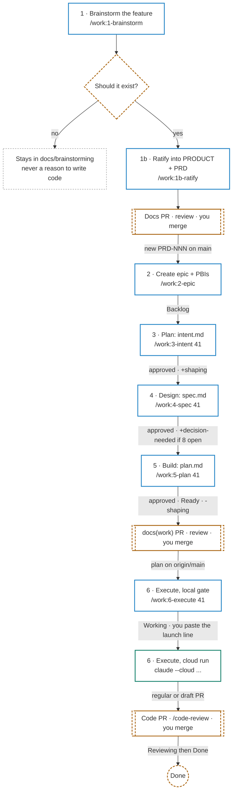

# Work artifacts

One folder per work item, holding the three artifacts of the Plan → Design → Build process —
`intent.md`, `spec.md`, `plan.md` — and a `README.md` that says which of them are done.
Everything here is **transient** — the folder is deleted
once its content has landed in code, in a migration, and in whatever permanent document it
feeds.

Naming is `<issue#>-<slug>-<PRD-NNN>/`, for example `041-contact-records-PRD-008/`:

- **`<issue#>`** is the issue on the [CuevikSync
  project](https://github.com/orgs/Cueserve/projects/17), zero-padded to three digits so the
  listing sorts. **Every folder carries one** — `/work:1-intent` files the issue when you do
  not give it one, so there is no work in flight that the board does not know about.
- **`<PRD-NNN>`** is the one the issue title cites. Work that traces to no PRD — a bug fix, a
  refactor — drops the suffix: `052-fix-login-redirect/`. Work touching several PRDs still
  names one; `spec.md` lists the rest.
- **The name is fixed when `/work:1-intent` creates the folder and is never renamed**, so no
  link, commit, or PR reference to it goes stale. A PRD number assigned later lives in
  `spec.md`.

The date the folder was created is in its `README.md`, not its name.

## End-to-end workflow

From an idea to a merged PR. Each step is one command in its own fresh session. It produces one
artifact and waits for your explicit yes before the next step will run. Plans execute
unattended in a Claude cloud session. Review, merge, and the `Reviewing`/`Done` card moves stay
with you.

| Step               | Command                                     | Runs in          | Produces                                            | Gate · board                             |
| ------------------ | ------------------------------------------- | ---------------- | --------------------------------------------------- | ---------------------------------------- |
| 1. Brainstorm      | `/work:1-brainstorm "<topic>"`              | local            | `docs/brainstorming/<topic>.md` (Draft)             | you decide it should exist               |
| 1b. Ratify         | `/work:1b-ratify <brainstorm file>`         | local            | new `PRD-NNN` in `docs/PRODUCT.md` + `docs/PRD.md`  | standalone docs PR, you merge            |
| 2. Epic + PBIs     | `/work:2-epic PRD-NNN..PRD-MMM`             | local → GitHub   | `Epic:` issue + `PRD-NNN:` sub-issues on Project 17 | you approve before filing · `Backlog`    |
| 3. Intent          | `/work:3-intent <issue#>`                   | local            | `intent.md`                                         | Approved · +`shaping`                    |
| 4. Spec            | `/work:4-spec <issue#>`                     | local            | `spec.md`                                           | Approved · +`decision-needed` if §8 open |
| 5. Plan            | `/work:5-plan <issue#>`                     | local            | `plan.md`, then a `docs(work)` PR you merge         | Approved · `Ready` · −`shaping`          |
| 6. Execute         | `/work:6-execute <issue#>`                  | local            | card → `Working`, prints the launch line            | plan on `origin/main`, card `Ready`      |
|                    | `claude --cloud "/work:6-execute <folder>"` | terminal → cloud | `feat/<slug>` branch + PR (draft if blocked)        | lint · typecheck · format:check · test   |
| After the PR (you) | `/code-review <PR#>`, `/db-migrate`         | local            | review, merge                                       | `Reviewing` → `Done`                     |

Superpowers used along the way: `superpowers:brainstorming` (steps 1 and 3),
`/impeccable shape` (step 4, UI slices only), `superpowers:test-driven-development` (step 5 —
every `proof` fails before its task), `superpowers:dispatching-parallel-agents` and
`superpowers:verification-before-completion` (step 6, in the cloud),
`superpowers:systematic-debugging` and `superpowers:receiving-code-review` (after the PR).



Blue is a local Claude session, green the cloud session, dashed amber is you. The three PRs are
the only way anything reaches `main`.

## The three steps

Each step is its own command, its own session, and its own approval.

| Step      | Command          | Artifact    | Refuses to run when                                          |
| --------- | ---------------- | ----------- | ------------------------------------------------------------ |
| 1. Plan   | `/work:1-intent` | `intent.md` | an open question is neither answered nor explicitly deferred |
| 2. Design | `/work:2-spec`   | `spec.md`   | `intent.md` is missing or still `Status: Draft`              |
| 3. Build  | `/work:3-plan`   | `plan.md`   | `spec.md` is missing or still `Status: Draft`                |

A step reads only the previous artifact, never the conversation that produced it. That is the
point: an artifact a cold session cannot act on is not finished, and the session that executes
`plan.md` is the coldest one of all.

**Executing `plan.md` is not a fourth step** — it writes no artifact. Run it in a fresh local
session, or unattended with `/work:4-execute <issue#>`: run locally, that checks the plan is
approved and pushed, sets the card to `Working`, and prints the `claude --cloud` line for you to
paste into a terminal. The cloud session runs the same command and stops where the plan's
Delivery hands control back to you.

## What a folder holds

Four files. Three are the artifacts; the fourth is how you find your way back in.

```text
docs/work/041-contact-records-PRD-008/
  README.md    preface + progression + what to run next
  intent.md    step 1
  spec.md      step 2
  plan.md      step 3
```

**The `**Status:**` line in each artifact's own header is the truth** — `Draft` or `Approved`.
A command writes its artifact as `Draft` and asks; `Approved` is only ever set by an explicit
human yes, which is what makes the next step's refusal mean something.

**The folder's `README.md` is the rollup**, regenerated from those headers by every command
that runs. It cannot drift, because nothing reads it to decide anything — it exists so that
opening the folder after two weeks away tells you where you are and what to type:

```markdown
# Contact and company records

**Created:** 2026-09-18
**Work item:** [#41 PRD-008: Contact and company records](https://github.com/Cueserve/cs-cueviksync/issues/41)
**Board:** Backlog · `shaping`

Person and Organization as first-class records, with the duplicate detection PRD-010 requires.
Scoped to the Print & Signage vertical; the painter's-company variant stays out.

## Progress

| Step      | Artifact               | Status   | Updated    |
| --------- | ---------------------- | -------- | ---------- |
| 1. Plan   | [intent.md](intent.md) | Approved | 2026-09-18 |
| 2. Design | [spec.md](spec.md)     | Draft    | 2026-09-18 |
| 3. Build  | [plan.md](plan.md)     | —        | —          |

**Next:** approve `spec.md`, or revise it and re-run `/work:2-spec`.
```

**Created** is the day `/work:1-intent` made the folder. No artifact header records it, so a
command regenerating this file copies it from the existing `README.md` and never rewrites it.

The preface is two to four sentences, written from the approved intent and refreshed by a later
step only if the framing actually changed. **Board** is the Status plus any state label, copied
from the item as the command last left it — the mapping is below.

## The board

**Status is pipeline position.** It only moves forward, and only when something about the code
has changed. Shaping is carried by a **label** instead, because one single-select field cannot
say both "how far along is this" and "is this in my hands right now" without being wrong
somewhere in the week.

| When                            | Status      | Label                         | Set by                                                                 |
| ------------------------------- | ----------- | ----------------------------- | ---------------------------------------------------------------------- |
| a new issue is filed            | `Backlog`   | —                             | `/work:1-intent`                                                       |
| the work folder is created      | `Backlog`   | +`shaping`                    | `/work:1-intent`                                                       |
| `spec.md` approved, §8 unticked | unchanged   | +`decision-needed`            | `/work:2-spec`                                                         |
| `plan.md` approved              | `Ready`     | −`shaping` −`decision-needed` | `/work:3-plan`                                                         |
| the build session starts        | `Working`   | —                             | the executing session, or `/work:4-execute` locally before a cloud run |
| the PR opens                    | `Reviewing` | —                             | the executing session; **you** after a cloud run                       |
| the PR merges                   | `Done`      | —                             | **you**                                                                |

**`shaping` on an issue means a work folder is open for it whose plan is not approved.** That
biconditional is the whole value of the label: the board answers "what am I in the middle of"
without opening anything.

`decision-needed` already meant "Open product decision; no code until decided", which is
exactly an approved spec with an unticked §8 escalation trigger. `/work:3-plan` removes it on
the run that gets past that gate.

**`Done` is deliberately yours.** You merge the PR — `.claude/hooks/block-remote-writes.mjs`
exists to keep that a human act — so you close the card. `Testing` and `Blocked` are untouched
by these commands and free for you.

### The calls

```sh
# the project item id for an issue (its `id`, PVTI_...)
gh project item-list 17 --owner Cueserve --format json --limit 100

# Status
gh project item-edit --id <item id> --project-id PVT_kwDOAWKwws4BgZo3 --field-id PVTSSF_lADOAWKwws4BgZo3zhay328 --single-select-option-id <option>

# labels
gh issue edit <n> --repo Cueserve/cs-cueviksync --add-label shaping
gh issue edit <n> --repo Cueserve/cs-cueviksync --remove-label shaping
```

Option ids: `40feac3a` Backlog · `5c76395f` Ready · `f75ad846` Working · `47fc9ee4` Testing ·
`ae2be21a` Reviewing · `0cd4f388` Blocked · `98236657` Done. If any id is rejected, re-read
them with `gh project field-list 17 --owner Cueserve --format json` rather than guessing — a
recreated project changes them.

Every board write prompts. Nothing reaches GitHub without an approval click.

## Authority

A file here is **not** a source-of-truth document. It is authoritative for its own work item
until that item merges, and carries no standing outside it: an `intent.md` cannot justify a
change to `docs/`, and a `spec.md` here does not outrank `docs/PRD.md`. Where one disagrees
with a `docs/` file, the `docs/` file wins and the disagreement is a defect in the artifact.

Because it is not source-of-truth, `docs/work/` is exempt from
[CONTRIBUTING.md](../../CONTRIBUTING.md)'s standalone-documentation-Pull-Request rule: these
three files ride in the feature Pull Request (PR) that implements them.

## Not `docs/brainstorming/`

`docs/brainstorming/` is open-ended, permanent exploration of a **topic**. It may contradict
the source-of-truth documents, it is never tied to a work item, and it is never a reason to
write code. A folder here is a **committed** work item: it has an issue number and a route to
merge.

If the question is still whether a thing should exist, that is brainstorming. Once you have
decided it should, run `/work:1-intent`.

See [docs/PROJECT-STRUCTURE.md](../PROJECT-STRUCTURE.md) §5 for the full document-kind table.
