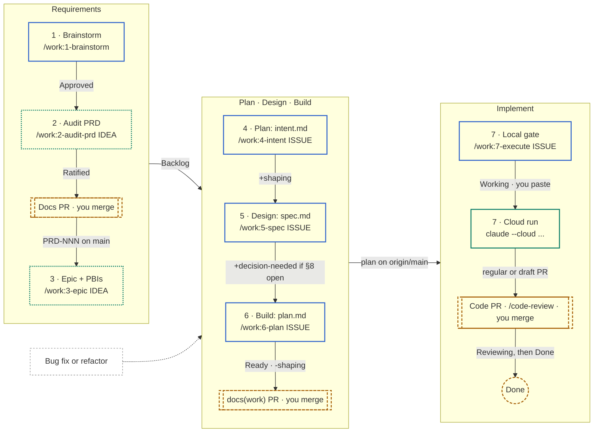

# Work artifacts

Everything between an idea and a merged PR, in two kinds of folder:

- **`brainstorming/`** — one file per idea, for steps 1–2. Ideas are kept as the record of each
  decision and are never authoritative. Its own [README](brainstorming/README.md) has the rules.
- **One folder per work item**, for steps 4–7, holding the three artifacts of the Plan → Design
  → Build steps — `intent.md`, `spec.md`, `plan.md` — and a `README.md` that says which of them
  are done. These are **transient**: the folder is deleted once its content has landed in code,
  in a migration, and in whatever permanent document it feeds.

Naming is `<issue#>-<slug>-<PRD-NNN>/`, for example `041-contact-records-PRD-008/`:

- **`<issue#>`** is the issue on the
  [CuevikSync Tracker](https://github.com/orgs/Cueserve/projects/17), zero-padded to three
  digits so the listing sorts. **Every folder carries one** — `/work:3-epic` files the issue for
  a requirement, and `/work:4-intent` files it itself for a bug fix or refactor, so there is no
  work in flight that the board does not know about.
- **`<PRD-NNN>`** is the one the issue title cites. Work that traces to no PRD — a bug fix, a
  refactor — drops the suffix: `052-fix-login-redirect/`. Work touching several PRDs still
  names one; `spec.md` lists the rest.
- **The name is fixed when `/work:4-intent` creates the folder and is never renamed**, so no
  link, commit, or PR reference to it goes stale. A PRD number assigned later lives in
  `spec.md`.

The date the folder was created is in its `README.md`, not its name.

## The seven steps

Each step is its own command, its own session, and its own approval.

| Phase        | Step | Command                                     | Runs in                | Produces                                              | Refuses to run when                                                          |
| ------------ | ---- | ------------------------------------------- | ---------------------- | ----------------------------------------------------- | ---------------------------------------------------------------------------- |
| Requirements | 1    | `/work:1-brainstorm ["<topic>" \| <idea#>]` | local                  | `brainstorming/<NNN>-<slug>.md` on `docs/idea-*`      | an open question is neither answered nor explicitly deferred                 |
|              | 2    | `/work:2-audit-prd <idea#>`                 | local or cloud         | PRODUCT.md / PRD.md change, `/doc-audit`, the docs PR | the idea is not `Approved`                                                   |
|              | 3    | `/work:3-epic <idea#> \| PRD-NNN …`         | local or cloud         | epic and PBI issues, sub-issues, blocked-by links     | the idea is not `Ratified` on `main`, or an ID is not in PRD.md there        |
| Plan         | 4    | `/work:4-intent <issue#>`                   | local, fresh session   | `intent.md`                                           | an open question is neither answered nor explicitly deferred                 |
| Design       | 5    | `/work:5-spec <issue#>`                     | local, fresh session   | `spec.md`                                             | `intent.md` is missing or still `Status: Draft`                              |
| Build        | 6    | `/work:6-plan <issue#>`                     | local, fresh session   | `plan.md`                                             | `spec.md` is missing or `Draft`, or a §8 box is unticked                     |
| Implement    | 7    | `/work:7-execute <issue#>`                  | local gate, then cloud | the code PR                                           | `plan.md` is not `Approved` and on `origin/main`, or the card is not `Ready` |

A step reads only the previous artifact, never the conversation that produced it. That is the
point: an artifact a cold session cannot act on is not finished, and the session that executes
`plan.md` is the coldest one of all.

**A bug fix or refactor that changes no requirement starts at step 4** — give `/work:4-intent` a
free description and it files the issue.

**Steps 2 and 3 can run in a cloud session**, interactively — you answer their questions at
claude.ai/code. A cloud session clones the remote, so the idea branch must be pushed (step 1
does) and step 3 reads only `origin/main`.

**Step 7 writes no artifact.** Run locally, `/work:7-execute` checks the plan is approved and on
`origin/main`, sets the card to `Working`, and prints the line for you to paste into a terminal:

```sh
claude --cloud "/work:7-execute <folder>"
```

The cloud session runs the same command unattended and stops where the plan's Delivery hands
control back to you. You can also execute a plan in a fresh local session instead.

**Three pull requests** carry a requirement to `main`: the docs PR from step 2; the `docs(work)`
PR that lands the approved `intent.md`, `spec.md`, and `plan.md` before a cloud run; and the code
PR from step 7. You merge each one.

Superpowers used along the way: `superpowers:brainstorming` (steps 1 and 4), `/doc-audit`
(step 2), `/impeccable shape` (step 5, UI slices only), `superpowers:test-driven-development`
(step 6 — every `proof` fails before its task), `superpowers:dispatching-parallel-agents` and
`superpowers:verification-before-completion` (step 7, in the cloud), then `/code-review`,
`superpowers:systematic-debugging`, and `superpowers:receiving-code-review` after the PR opens.



Blue is a local Claude session, green the cloud, dotted green either one, and dashed amber is
you. A printable version is [delivery-workflow.pdf](delivery-workflow.pdf).

## What a folder holds

Four files. Three are the artifacts; the fourth is how you find your way back in.

```text
docs/work/041-contact-records-PRD-008/
  README.md    preface + progression + what to run next
  intent.md    step 4
  spec.md      step 5
  plan.md      step 6
```

**The `**Status:**` line in each artifact's own header is the truth** — `Draft` or `Approved`.
A command writes its artifact as `Draft` and asks; `Approved` is only ever set by an explicit
human yes, which is what makes the next step's refusal mean something.

**The folder's `README.md` is the rollup**, regenerated from those headers by every command
that runs. It cannot drift, because nothing reads it to decide anything — it exists so that
opening the folder after two weeks away tells you where you are and what to type:

```markdown
# Contact and company records

**Created:** 2026-09-18
**Work item:** [#41 PRD-008: Contact and company records](https://github.com/Cueserve/cs-cueviksync/issues/41)
**Board:** Backlog · `shaping`

Person and Organization as first-class records, with the duplicate detection PRD-010 requires.
Scoped to the Print & Signage vertical; the painter's-company variant stays out.

## Progress

| Step      | Artifact               | Status   | Updated    |
| --------- | ---------------------- | -------- | ---------- |
| 4. Plan   | [intent.md](intent.md) | Approved | 2026-09-18 |
| 5. Design | [spec.md](spec.md)     | Draft    | 2026-09-18 |
| 6. Build  | [plan.md](plan.md)     | —        | —          |

**Next:** approve `spec.md`, or revise it and re-run `/work:5-spec`.
```

**Created** is the day `/work:4-intent` made the folder. No artifact header records it, so a
command regenerating this file copies it from the existing `README.md` and never rewrites it.

The preface is two to four sentences, written from the approved intent and refreshed by a later
step only if the framing actually changed. **Board** is the Status plus any state label, copied
from the item as the command last left it — the mapping is below.

## The board

**Status is pipeline position.** It only moves forward, and only when something about the code
has changed. Shaping is carried by a **label** instead, because one single-select field cannot
say both "how far along is this" and "is this in my hands right now" without being wrong
somewhere in the week.

| When                             | Status      | Label                         | Set by                                                                  |
| -------------------------------- | ----------- | ----------------------------- | ----------------------------------------------------------------------- |
| a PBI is filed for a requirement | `Backlog`   | —                             | `/work:3-epic` locally; the board's Auto-add workflow after a cloud run |
| an issue is filed for a bug fix  | `Backlog`   | —                             | `/work:4-intent`                                                        |
| the work folder is created       | `Backlog`   | +`shaping`                    | `/work:4-intent`                                                        |
| `spec.md` approved, §8 unticked  | unchanged   | +`decision-needed`            | `/work:5-spec`                                                          |
| `plan.md` approved               | `Ready`     | −`shaping` −`decision-needed` | `/work:6-plan`                                                          |
| the build session starts         | `Working`   | —                             | the executing session, or `/work:7-execute` locally before a cloud run  |
| the PR opens                     | `Reviewing` | —                             | the executing session; **you** after a cloud run                        |
| the PR merges                    | `Done`      | —                             | **you**                                                                 |

**`shaping` on an issue means a work folder is open for it whose plan is not approved.** That
biconditional is the whole value of the label: the board answers "what am I in the middle of"
without opening anything.

`decision-needed` already meant "Open product decision; no code until decided", which is
exactly an approved spec with an unticked §8 escalation trigger. `/work:6-plan` removes it on
the run that gets past that gate.

**`Done` is deliberately yours.** You merge the PR — `.claude/hooks/block-remote-writes.mjs`
exists to keep that a human act — so you close the card. `Testing` and `Blocked` are untouched
by these commands and free for you.

**The cloud cannot reach the board.** Its GitHub proxy blocks Projects v2, so no cloud session
moves a card or adds an issue. Issues filed by a cloud run of `/work:3-epic` reach the board
only through the project's **Auto-add** workflow (Project settings → Workflows, repository
`cs-cueviksync`, filter `is:issue`); without it, add them locally with
`gh project item-add`.

### The calls

```sh
# the project item id for an issue (its `id`, PVTI_...)
gh project item-list 17 --owner Cueserve --format json --limit 100

# Status
gh project item-edit --id <item id> --project-id PVT_kwDOAWKwws4BgZo3 --field-id PVTSSF_lADOAWKwws4BgZo3zhay328 --single-select-option-id <option>

# labels
gh issue edit <n> --repo Cueserve/cs-cueviksync --add-label shaping
gh issue edit <n> --repo Cueserve/cs-cueviksync --remove-label shaping
```

Option ids: `40feac3a` Backlog · `5c76395f` Ready · `f75ad846` Working · `47fc9ee4` Testing ·
`ae2be21a` Reviewing · `0cd4f388` Blocked · `98236657` Done. If any id is rejected, re-read
them with `gh project field-list 17 --owner Cueserve --format json` rather than guessing — a
recreated project changes them.

Every board write prompts. Nothing reaches GitHub without an approval click.

## Authority

A file here is **not** a source-of-truth document. It is authoritative for its own work item
until that item merges, and carries no standing outside it: an `intent.md` cannot justify a
change to `docs/`, and a `spec.md` here does not outrank `docs/PRD.md`. Where one disagrees
with a `docs/` file, the `docs/` file wins and the disagreement is a defect in the artifact.

Because it is not source-of-truth, a work folder is exempt from
[CONTRIBUTING.md](../../CONTRIBUTING.md)'s standalone-documentation-Pull-Request rule. Its three
artifacts land in a `docs(work)` PR before a cloud run — `/work:7-execute` reads the plan from
`origin/main` — or ride in the feature PR when the plan is executed locally.

## Ideas versus work items

An idea in `brainstorming/` is a question still open: should this thing exist, and in what
shape. A work folder is a **committed** work item: it has an issue number, a requirement on
`main` behind it, and a route to merge. The boundary is step 3 — once the requirement is ratified
and its issue filed, the work moves to `/work:4-intent` and a folder here.

Do not cite an idea as a reason to write code. See
[docs/PROJECT-STRUCTURE.md](../PROJECT-STRUCTURE.md) §5 for the full document-kind table.
